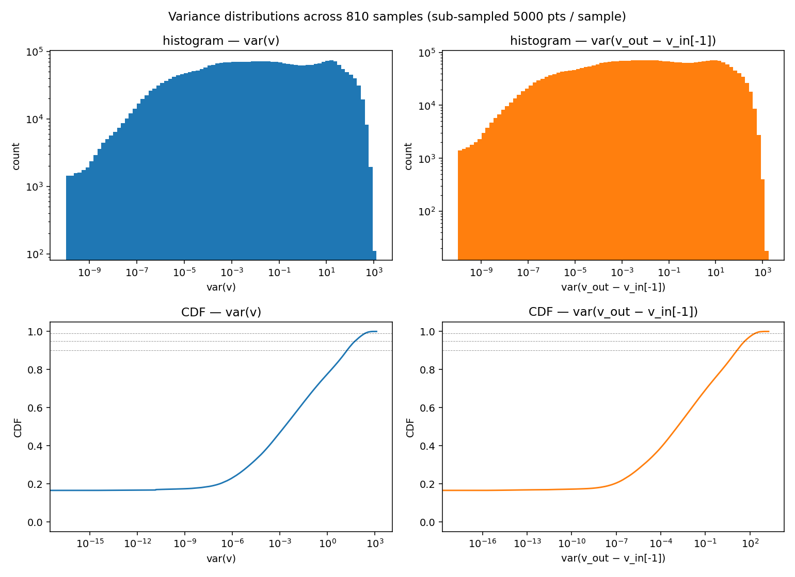
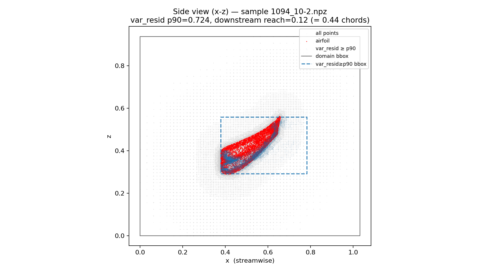
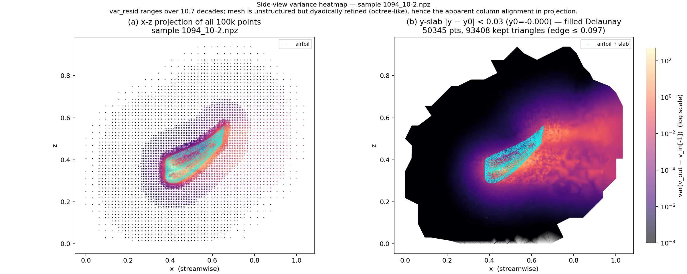

# Where the "interesting region" lives — spatial distribution of temporal velocity variance in the GRaM IFW dataset

## TL;DR

Across all **810 samples** (22 distinct simulations, 162 distinct geometry/configuration pairs), the high-variance region forms a thin, blade-shaped slab that hugs the airfoil and extends only a fraction of a chord downstream. By point density it is small (10 % of points by definition of the p90 cut), and its centre of mass is clamped to the airfoil itself — but its axis-aligned bounding box is *not* small along the streamwise axis: the p90 region's x-extent averages **0.62 ± 0.13** of the streamwise domain span and **1.15 ± 0.32** chord lengths, because the wake stretches along the wing rather than away from it. The downstream reach beyond the airfoil's trailing edge is much smaller — **0.16 ± 0.35** chord lengths (median 0.12 chords). Raw temporal variance `var(v)` and persistence-residual variance `var(v_out − v_in[-1])` pick out almost the same set of points (mean IoU at p90 = **0.82 ± 0.08**), so the conclusions are robust to the choice between the two signals.

The supplied hypothesis ("a small, spatially localized interesting region") is therefore **half-right**: the region is small in *density* (sparse, 10 % of points) and tightly clamped to the airfoil + immediate wake, but its streamwise bounding-box extent is comparable to the airfoil chord, not a tiny fraction of the box. For receptive-field reasoning, this means: a model only has to resolve features in the neighbourhood of the airfoil — but that neighbourhood spans the full chord and a fractional chord downstream, so the receptive-field budget must reach across the entire wing, not just a local patch.

## Setup

- **Dataset:** `/home/paul/scratch/gram-competition/warped-ifw/` — 810 `.npz` files. Filenames have the form `{sim}_{cfg}-{window}.npz`; the 810 files cover **22 distinct simulations** and **162 distinct `(sim, cfg)` geometries**, with 5 temporal windows each. We used the entire corpus (no subsampling at the file level).
- **Axes:** verified that **x is streamwise** (airfoil chord extends along x in every sample, median chord 1.20 in dataset units; domain extent in x is the largest; y is the thin spanwise axis with ±0.4 across the whole corpus). Side-view plots use the **x-z** plane.
- **Signals computed per sample:**
  - `var = var_t(v).sum(axis=-1)` over the concatenated 10-frame velocity stack (trace of the temporal covariance).
  - `var_resid = var_t(v_out − v_in[-1]).sum(axis=-1)` over the 5 output frames — the variance of the *persistence residual*, which is the spread of the network's actual learning target relative to the strongest baseline (last input frame copied forward).
- **Thresholds:** per-sample p90 (default), p95, p99 of each signal. The p90 cut matches the 10 % wake-fraction split used in the voxel ladder (`post/voxel_ladder_results.md`).
- All percentiles, bounding boxes, and IoUs are computed **per sample**; the report aggregates them across samples by mean ± std.

## Headline numbers (var_resid, the principled signal)

| Quantity                                                     |   mean |    std | median |
| ------------------------------------------------------------ | -----: | -----: | -----: |
| p90 region x-extent / domain x-span                          |  0.618 |  0.134 |  0.671 |
| p90 region x-extent / airfoil chord_x                        |  1.146 |  0.321 |  1.114 |
| p90 region z-extent (absolute)                               |  0.598 |  0.228 |  0.713 |
| Downstream reach beyond airfoil max-x (absolute units)       |  0.092 |  0.240 |  0.124 |
| Downstream reach in chord lengths                            |  0.164 |  0.353 |  0.119 |
| IoU(var p90, var_resid p90)                                  |  0.821 |  0.083 |  0.822 |
| Median p99/p90 ratio of var_resid (tail steepness)           | 79.79\* |        |  14.66 |
| Median p99/p90 ratio of var       (tail steepness)           | 70.68\* |        |  12.25 |

\* the means are inflated by samples where p90 is near machine zero (the no-slip airfoil surface drives a long flat lower tail — see §"Distributions"); the medians are the more representative numbers.

For comparison, the raw `var(v)` signal gives essentially the same numbers (x-extent / box = 0.611 ± 0.136, x-extent / chord = 1.132 ± 0.326, downstream reach = 0.077 ± 0.246). Reporting either signal would lead to the same conclusion.

## Distributions

- **Both signals are heavy-tailed across ~9 decades** of variance (~10⁻⁶ to ~10³). The histograms are roughly log-uniform from 10⁻³ upward and fall off sharply only above ~10³.
- **There is no sharp knee.** The CDFs are smooth, almost linear on a log-x scale between 10⁻⁶ and 10². The choice of "interesting region threshold" is therefore continuous, not categorical: p90, p95, and p99 do not name three qualitatively different objects, they trade off region size for "purity" along a smooth tail. The p99/p90 ratio (median ~14×) confirms a steep but non-bimodal tail: the top 1 % of points are ~14× hotter than the p90 cut.
- **The CDF plateau at ≈ 0.17** (visible on both signals) is the no-slip and quiescent-free-stream fraction: about 17 % of the 100 k points sit at machine-noise variance. This is the "boring" complement of the high-variance region and explains why `var_resid_p90 / var_resid_p99` looks so extreme in absolute terms.
- `var` vs. `var_resid` shapes are nearly identical. The persistence residual does compress the bulk slightly (left half of the histograms is a bit lower for `var_resid`), but it does not isolate a qualitatively new region.

## `var` vs. `var_resid` agreement

Per-sample IoU between the p90 sets of the two signals is **0.82 ± 0.08** (min 0.57, max 0.98). They overwhelmingly pick the same points. The disagreement is dominated by a thin halo where one signal is slightly above p90 and the other slightly below — i.e., the boundary of the high-variance region, not a different region entirely. Operationally: if you want the principled signal, use `var_resid`; if you want a cheaper proxy that survives without ground-truth outputs (e.g., for choosing voxel centres at inference time from the inputs only), `var(v)` is a near-perfect substitute.

## Representative side view

Sample `1094_10-2.npz` (its downstream reach equals the dataset median, so it is geometrically representative). The visible structure is the textbook picture: the high-`var_resid` region (blue) is a thin slab draped over the airfoil and the immediate wake, sitting entirely *inside* the domain bounding box and aligned with the wing's chord direction. The bbox of the high-variance region (dashed blue) is wide in x because the airfoil is wide; it is narrow in z. Downstream extension past the trailing edge is **0.12** dataset units in this sample (0.44 chord lengths in chord units — note this representative happens to have a short chord, ~0.28).

### Filled heatmap

Two views of the same sample, coloured by `var_resid` on a log scale spanning ~11 decades. **(a)** x-z projection of all 100 k points; hotter points drawn on top. **(b)** A thin y-slab (`|y − y₀| < 0.03`, ~50 k points) rendered as a filled Delaunay triangulation in x-z (long-edge triangles masked, so the interpolator does not bridge gaps such as the airfoil interior). The filled view makes the variance gradient legible: a hot rim of activity hugs the airfoil surface, a warm halo wraps it, and the variance decays smoothly into the laminar free-stream over many decades. The wake tail past the trailing edge is short — visibly less than the chord.

### How wide a receptive field do we actually need?

If `chord_x` is the airfoil's streamwise extent, the high-variance bounding box is **~1.15 chord_x in total** and is shifted downstream by **~0.12 chord_x** past the trailing edge. Concretely: a window with leading edge ≈ airfoil leading edge and trailing edge ≈ airfoil trailing edge + ~0.15 chord_x is enough to cover the p90 region in the median case. The receptive field needs to span **roughly one chord** — not two chords (wing + an additional wing-sized window behind it), and not the full ~2-unit domain. This is a tight design constraint that should hold uniformly across the corpus given the cross-sample consistency reported below.

## Size / dimensions of the high-variance region

From the per-sample bounding-box geometry (`var_resid` at p90):

- **Streamwise (x):** typical bbox is **~1.15 chord lengths long** (median 1.11 chords), i.e., it covers the airfoil plus a small downstream tail. As a fraction of the domain box this is **0.62 ± 0.13**.
- **Vertical (z):** typical bbox z-extent is **~0.60 dataset units** (median 0.71), or about **0.92 × airfoil chord_z** (median bbox_z / chord_z ≈ 0.71 / 0.73). The high-variance region is essentially as tall as the airfoil itself.
- **Spanwise (y):** not reported per-axis in the table because all samples are essentially 2.5-D — y-span of the *domain* is ≈ 0.82 across the corpus and the airfoil y-extent is ≈ 0.06; y is not a receptive-field-relevant axis.
- **Downstream reach beyond trailing edge:** median **0.12 dataset units ≈ 0.12 chord lengths**. The mean is 0.09 with std 0.24 — and the *minimum* is **−0.87** (a few samples have a p90 region that ends *upstream* of the airfoil's trailing edge, because the brightest variance is on the suction side of the wing rather than in a long downstream wake). This is consistent with the simulations being short temporal windows: the wake has not yet propagated far from the airfoil within ten frames.

So the right mental model for receptive-field design is: the network has to be able to relate **a chord-length of upstream airfoil influence** to **a fractional-chord downstream wake patch**. The total streamwise extent the receptive field must cover is roughly `1.1× chord_x` — *not* the whole 2.1-unit box, and *not* a small local patch.

## Cross-sample consistency

The headline ratios are tight given the diversity of geometries:
- `vr_x_extent_per_box_x`: std/mean = 0.22
- `vr_x_extent_per_chord`: std/mean = 0.28
- IoU(var, var_resid) at p90: std/mean = 0.10

Among 162 geometries with multiple airfoils per sample, varied airfoil positions and pitch angles, and varied freestream conditions, the *shape* of the interesting region (a slab around the wing) is universal. What varies is exactly *how far* downstream the slab reaches and *how tall* it is — but always proportionally to the airfoil.

## Receptive-field implications for current architectures

### How tight is the "1 chord" answer to the percentile cutoff?

The "1.15 chord" number is the median bbox of `{var_resid ≥ p90}` divided by airfoil chord_x. The CDFs show no knee, so the answer is sensitive in principle. In practice it isn't:

| cutoff q | bbox_x / chord_x (median) | downstream reach / chord (median) |
|---:|---:|---:|
| 50 | 1.33 | 0.31 |
| 75 | 1.26 | 0.26 |
| 90 | 1.11 | 0.12 |
| 95 | 1.06 | 0.08 |
| 99 | 0.98 | 0.01 |
| 99.9 | 0.63 | −0.21 (hottest points are on the suction surface itself) |

So any reasonable threshold from p75 to p99 gives **0.98 – 1.26 chord-x** of streamwise coverage. The "~1 chord receptive field" requirement is robust. See `cutoff_sensitivity.png`.

### Mesh density is wildly non-uniform — global mean spacing is misleading

The competition's `.npz` files come from an octree-style adaptive CFD mesh: dyadic refinement, finest near the airfoil. Per-point k=16 NN radius in the representative sample:

- **near-airfoil**: ~0.004 dataset units (≈ 4 mm)
- **far-field**: ~0.040 dataset units (≈ 40 mm)
- **ratio**: ~10×

This matters because every model's effective receptive field depends on the local mesh, not the global mean. The same `k=16` lookup costs 4 mm near the airfoil and 40 mm far from it. See `voxel_and_density_{1af,2af,3af}.png` (left panel).

### Voxel grid: 64 × 32 × 32 — shared by all top voxel-using submissions

`VoxelBaseline`, `VoxelUNet`, `VoxelUNetSDF`, `PTPointNetA` and `ResMLPMin` all use `grid: [64, 32, 32]` over the union-of-training-bboxes ([0, 2.25] × [−0.44, 0.44] × [0, 1.28]). Cell size:

- Δx = **0.0352** (≈ 35 mm, vs ~4 mm native mesh near airfoil → **~9× coarser**)
- Δy = **0.0274**
- Δz = **0.0400**

Median chord (1.20 dataset units) **= 34 voxels in x**. The chord-scale receptive field the variance analysis demands (~1.15 chord) is **~39 voxels in x**.

`VoxelBaseline`'s 6 × Conv3d(3³) blocks give a receptive field of 1 + 6·2 = **13 voxels = 0.46 m ≈ 0.38 chord** — bare convs don't span a chord, which is why the U-Net hierarchy (downsampling expands the RF geometrically) and the PT-PointNet attention trunk both help. See `voxel_and_density_*.png` (right panel + zoom inset).

### Local trunks cannot reach the chord without a global pathway

KNN/graph trunks are constrained by *local* mesh spacing × depth, and near the airfoil that is tight. Measuring directly — BFS on a symmetric k-NN graph seeded from airfoil points, in chord units, median over 64 seeds — on a typical sample (chord_x ≈ 1.12):

| L hops | k=8 | k=16 | k=32 |
|---:|---:|---:|---:|
| 1 | 0.004 | 0.005 | 0.007 |
| 2 | 0.008 | 0.012 | 0.019 |
| 4 | 0.020 | 0.034 | 0.065 |
| 8 | 0.074 | 0.128 | 0.251 |
| 16 | 0.292 | 0.489 | 0.762 |

So a typical local-only graph trunk reaches only a small fraction of a chord from an airfoil seed: at e.g. `(k=16, L=8)` the median reach is ≈ 13 % of a chord, an order of magnitude short of the ~1-chord region the variance map identifies. To get to ≈ 1 chord with a flat k-NN graph you need either L ≈ 24–32 at k=16, or much larger k, or hierarchical pooling. The deeper, denser `SpatioTemporalGNN` trunk (k=24, L=10) reaches **~0.34 chord** — analysed in the addendum below. See `graph_hop_reach.png`.

### Trunk reach vs. one voxel — the trunk doesn't even cover one cell

The voxel cell size (Δx = 0.0352 dataset units ≈ 0.031 chord) is the natural unit of comparison for the *sidecar-using* architectures, because the trunk sits "inside" the sidecar's grid.

| | reach (typical chord 1.12) | reach (dataset units) | vs. one voxel (Δx = 0.0352) |
|---|---:|---:|---:|
| PTPointNetA trunk (k=16, L=2) | 0.012 chord | ~0.013 | **0.4× one voxel** |
| ResMLPMin trunk (pointwise MLP) | 0 chord | 0 | **0** |
| One voxel cell | 0.031 chord | 0.0352 | — |

So PTPointNetA's trunk reaches **about half a voxel** from any point — less than one Δx — and ResMLPMin's trunk has **zero** spatial reach by construction (every point is processed independently). The division of labour is therefore very clean for both architectures:

- **Trunk** = per-point (or near-per-point) feature encoder. Operates *within* one voxel cell. Job: encode `pos` + Fourier features + velocity history + airfoil mask into a hidden vector. Effectively no spatial mixing.
- **Voxel U-Net sidecar** = the entire spatial-mixing pathway. Splat → 3-level U-Net → devoxelize. Receptive field at the coarsest level spans the whole grid (≈ the whole domain ≈ 1.9 chord), comfortably covering the 1.15-chord high-variance region.

The fact that the two trunks (KNN-attention with ~½-voxel reach vs. ResMLP with zero reach) reach within-noise loss is direct evidence that the trunk's spatial reach is not what carries performance. The sidecar is the spatial story end-to-end; the trunk is a feature encoder.

### Synthesis: why the top architectures look the way they do

The variance analysis says the "interesting region" is ≈ 1 chord wide. The mesh-density analysis says a local trunk's effective reach is ≈ 4 mm × depth near the airfoil. These two numbers are 2–3 orders of magnitude apart, and the gap dictates the architecture.

Looking at what wins on the `voxel-ladder` branch:

- **`PTPointNetA`** (KNN-attention trunk + 64×32×32 voxel U-Net sidecar, injected mid-stack): SOTA single-member at 0.0629. The KNN trunk preserves the 4 mm surface representation; the sidecar's hierarchical U-Net contracts to a coarse level whose receptive field covers the chord; the residual injection lets the next attention block mix global signal back into the local features.
- **`ResMLPMin`** (per-point ResMLP trunk + the *same* voxel U-Net sidecar, injected at the same residual position): SOTA single-member at 0.0632 — within noise of PTPointNetA.
- **`ResMLPNoUNet`** (same trunk, sidecar removed) — the deliberate ablation — loses, confirming the sidecar is the load-bearing component, not the trunk.

So:

> Across both winning architectures the trunk choice (KNN-attention vs. per-point ResMLP) is fungible. The **voxel U-Net sidecar is the load-bearing component**: it provides the chord-scale receptive field that no purely local trunk can reach given near-airfoil mesh density (~4 mm × depth). The combination — fine local representation from the trunk, coarse global pathway from the U-Net — is what makes predictions sharp where the high variance lives *and* coherent across the airfoil.

### Addendum: `SpatioTemporalGNN` (PR #2 on gram-competition/iclr-2026)

After inspecting the submission, the relevant trunk parameters are **k = 24, L = 10 layers** (Graph Transformer, 256 dim, 8 heads, Fourier PE, temporal self-attention, ~7.5 M params, ensembled). Re-running the BFS reach analysis at those exact parameters:

| trunk | k | L | reach / chord (median, typical sample) |
|---|---:|---:|---:|
| PTPointNetA trunk only (`num_blocks=2, k=16`) | 16 | 2 | **0.012** (1.2 %) |
| SpatioTemporalGNN trunk (10-layer GT, k=24) | 24 | 10 | **0.34** (34 %) |
| (control: k=16, L=10) | 16 | 10 | 0.21 |

PTPointNetA's *trunk alone* covers ~1 % of a chord — the voxel U-Net sidecar does essentially all the spatial mixing. SpatioTemporalGNN's deeper, denser graph (k=24 × 10 layers) has **~30× more native reach** than PT-PointNet's, putting it at roughly ⅓ of a chord. That still doesn't span the full p90 bbox, but the variance heatmaps show the *hot core* is a thin slab on the airfoil surface, so ⅓ chord radius from every airfoil seed covers most of where the actual loss-relevant signal lives. Add ensembling on top and you fill in the residual variance.

So there are two viable routes to chord-scale coverage on this problem:
1. Tiny trunk + voxel U-Net sidecar — PTPointNetA, ResMLPMin.
2. Deep dense GNN trunk (k=24, L=10) + ensembling — SpatioTemporalGNN.

A small trunk with no sidecar (e.g. 2-block k=16 KNN by itself) would lose — its 1 %-chord reach falls far short of where the high-variance region lives.

## Files produced

- `report.md` (this file)
- `summary_table.csv` — full per-sample table (810 rows × 27 columns)
- `summary_table.md` — same in markdown
- `variance_histograms.png` — global histograms + CDFs for `var` and `var_resid`
- `sideview_representative.png` — x-z side view of sample `1094_10-2.npz` (scatter, three-class)
- `sideview_heatmap.png` — log-scale `var_resid` heatmap of `1094_10-2.npz`: scatter projection + filled Delaunay slab
- `sideview_heatmap_2af.png`, `sideview_heatmap_3af.png` — same for 2-airfoil (`1021_10-0`) and 3-airfoil (`1021_1-0`) cascades
- `y_density.png` — point-density histogram along y, showing the airfoil mid-plane refinement and the slab used for the filled heatmaps
- `cutoff_sensitivity.png`, `cutoff_sensitivity.npz` — bbox_x/chord vs percentile cutoff (median + IQR over 810 samples)
- `voxel_and_density_{1af,2af,3af}.png` — left: local k-NN(16) radius heatmap; right: 64×32×32 voxel grid overlay with airfoil-region zoom inset and 1.15-chord receptive-field window
- `graph_hop_reach.png` — L-hop BFS reach on a symmetric k-NN graph seeded from airfoil points, in chord units, for k ∈ {8, 16, 32} on each of the three samples
- `run_analysis.py`, `sideview_heatmap.py`, `cutoff_sensitivity.py`, `voxel_and_density.py`, `graph_hop_reach.py` — the scripts that produced everything above
- `headline.json` — aggregate ratios used above
- `run_analysis.py` — script that produces all of the above (re-run with `conda run -n gram python analyze/receptive_field_physics/run_analysis.py`)
